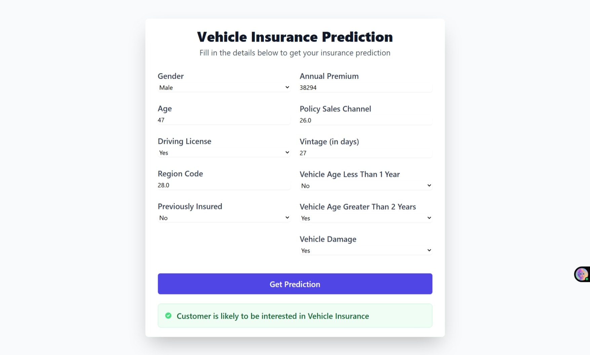
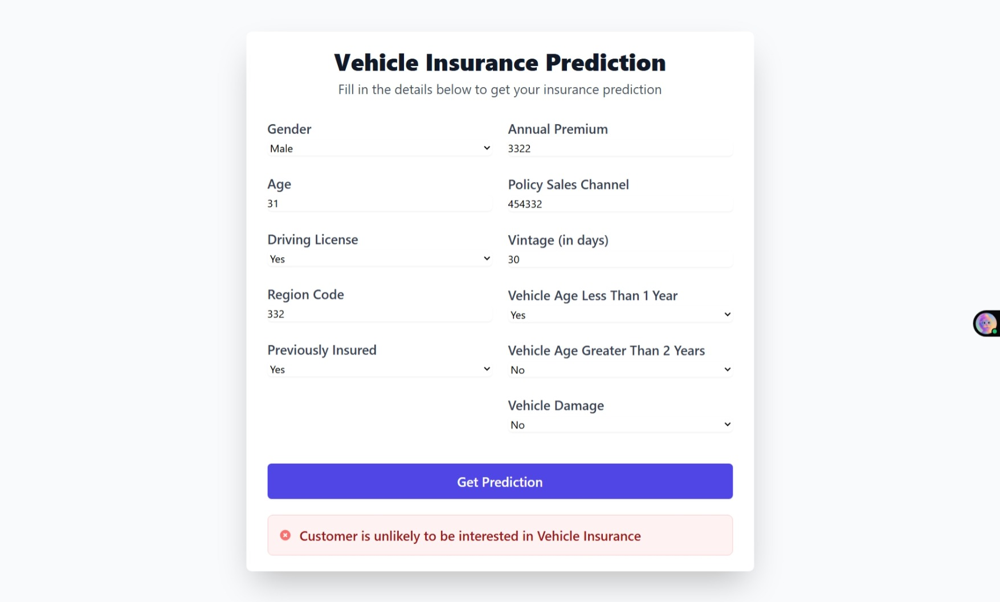
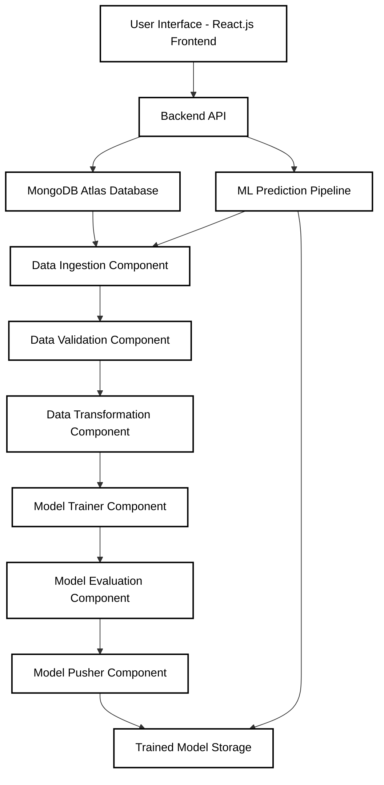

---

# InsureFlow - MLOps

InsureFlow is an end-to-end vehicle insurance prediction system built using MLOps principles. This project implements a fully automated machine learning pipeline integrated with a modern web interface, enabling users to input vehicle details and get accurate insurance predictions. It also includes a robust CI/CD pipeline for continuous integration and deployment.

---

## Live Demo

[](https://insure-flow-frontend.vercel.app/)


[](https://insure-flow-frontend.vercel.app/)

---

## Table of Contents
1. [Project Overview](#project-overview)
2. [Architecture](#architecture)
3. [Tech Stack](#tech-stack)
4. [Features](#features)
5. [Setup Instructions](#setup-instructions)
6. [MongoDB Atlas Setup](#mongodb-atlas-setup)
7. [ML Pipeline Workflow](#ml-pipeline-workflow)
8. [CI/CD Pipeline](#cicd-pipeline)
9. [Deployment](#deployment)
10. [Contributing](#contributing)
11. [License](#license)

---

## Project Overview

InsureFlow is designed to predict vehicle insurance eligibility based on multiple input features using machine learning models. The project follows an MLOps pipeline, covering data ingestion, data validation, data transformation, model training, model evaluation, model pusher, and deployment. The front end allows users to submit their details and view predictions in real-time, while the backend handles data processing and model inference.

This project demonstrates advanced backend complexity through its modular architecture, incorporating data pipelines, machine learning model management, and scalable API endpoints. The backend leverages Python for ML operations, ensuring high performance and reliability in a production environment.

---

## Architecture

The architecture of InsureFlow is designed for scalability, modularity, and robustness, integrating MLOps practices with a full-stack web application.

### High-Level Architecture Diagram



This diagram illustrates the flow from user input through the backend API to the ML pipeline components, highlighting the interconnected modules that handle data processing, model training, and inference.

### Backend Complexity

The backend architecture is highly complex, featuring:

- **Modular Component Design:** Each ML pipeline stage (ingestion, validation, transformation, training, evaluation, pusher) is implemented as a separate, reusable component with dependency injection and configuration management.
- **Data Pipeline Orchestration:** Automated workflows manage data flow between components, including error handling, logging, and artifact versioning.
- **Model Management System:** Implements model versioning, performance tracking, and automated deployment of the best-performing models.
- **Database Abstraction:** Custom data access layers abstract MongoDB operations, supporting schema validation and efficient querying.
- **Configuration and Environment Management:** Centralized configuration entities manage hyperparameters, database connections, and deployment settings across environments.
- **Exception Handling and Logging:** Comprehensive error tracking and logging frameworks ensure reliability and debuggability in production.
- **Cloud Storage Integration:** S3-compatible storage for model artifacts and datasets, with estimator classes for seamless cloud operations.

---

## Tech Stack

### MLOps (Python)
- **Core Libraries:** ipykernel, pandas, numpy, matplotlib, plotly, seaborn, scikit-learn, pymongo, from_root, dill, certifi, PyYAML, imblearn, joblib, python-dotenv
- **Database:** MongoDB Atlas
- **Pipeline:** Docker Image, Docker Hub, GitHub Actions, CI/CD
- **Deployment:** Render, Docker Hub, Vercel

---

## Features

- End-to-End ML Pipeline: Automated pipeline for data processing, model training, evaluation, and deployment, incorporating advanced techniques like feature engineering and hyperparameter tuning.
- Continuous Integration & Deployment: GitHub Actions trigger the CI/CD pipeline on every push to the main branch, ensuring rapid iteration and quality assurance.
- Dockerized Deployment: Both the app and model are containerized for consistent environments, enabling seamless scaling and portability.
- Database Integration: MongoDB Atlas for seamless data storage and retrieval, with optimized queries and indexing for performance.
- Model Management: Only the best-performing model is stored and used for prediction, with automated model selection based on evaluation metrics.

---

## Setup Instructions

### 1. Clone the Repository

```bash
git clone https://github.com/karangupta982/InsureFlow.git
cd insureflow
```

### 2. Create a Virtual Environment and Install Dependencies

```bash
# Create virtual environment
python -m venv venv
source venv/bin/activate    # For Windows: venv\Scripts\activate

# Install dependencies
pip install -r requirements.txt
```

### 3. Set Up Environment Variables

Create a `.env` file in the root directory and add:

```env
MONGODB_URL="mongodb+srv://<username>:<password>@cluster0.mongodb.net/<dbname>?retryWrites=true&w=majority"
```

### 4. MongoDB Atlas Setup

1. Sign up at [MongoDB Atlas](https://www.mongodb.com/cloud/atlas).
2. Create a project and cluster (M0 service).
3. Set up a DB user and IP access (`0.0.0.0/0`).
4. Get the connection string and update the `.env` file.

---

## ML Pipeline Workflow

1. **Data Ingestion:** Extracts data from MongoDB into a DataFrame, handling large datasets with efficient querying and pagination.
2. **Data Validation:** Checks schema consistency using `config.schema.yaml`, ensuring data quality and integrity before processing.
3. **Data Transformation:** Prepares the data for model training, including feature engineering, encoding categorical variables, and handling imbalanced datasets with SMOTE.
4. **Model Training:** Builds and evaluates multiple models using scikit-learn, with hyperparameter optimization and cross-validation.
5. **Model Evaluation:** Compares models and selects the best one based on metrics like accuracy, precision, recall, and F1-score.
6. **Model Pusher:** Deploys the best model to `my-model-mlopsproj` for inference, with versioning and rollback capabilities.

---

## CI/CD Pipeline

1. **Dockerization:** Built Docker images for both the backend and ML pipeline, using multi-stage builds for optimization.
2. **GitHub Actions:** Configured workflows in `.github/workflows/aws.yaml` to automate builds and deployments, including testing and security scans.
3. **Docker Hub:** Pushed Docker images to the Docker Hub repository for version control and distribution.
4. **Pipeline Trigger:** Every push to the main branch triggers the CI/CD pipeline, ensuring continuous delivery.

---

## Deployment

- Backend: Deployed on Render using `npm start` to launch the server, with environment variable management and health checks.
- Frontend: Deployed on Vercel for fast, global CDN delivery.
- Database: MongoDB Atlas stores all user inputs and predictions with high availability and backup.

---

## Contributing

Contributions are welcome! Please follow these steps:

1. Fork the repository.
2. Create a new branch (`feature/your-feature`).
3. Commit changes and push to your branch.
4. Create a pull request.


